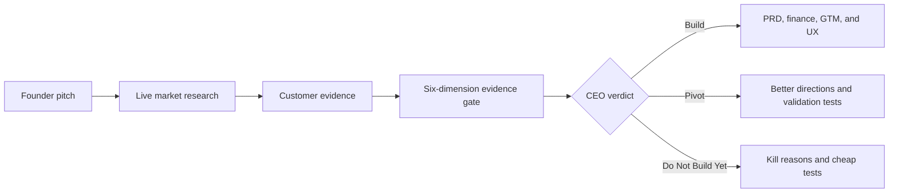

# IdeaCourt

**Put your startup idea on trial before you spend months building it.**

Most AI startup tools turn every idea into a confident product plan. IdeaCourt
does the opposite. It researches the market, looks for real customer pain, and
decides whether the idea deserves to move forward.

Every run ends with one of three verdicts:

- **Build**: the evidence is strong enough to unlock a complete startup plan.
- **Pivot**: the problem is real, but the customer, angle, or business model needs to change.
- **Do Not Build Yet**: the current evidence does not justify building.

IdeaCourt uses live search and real model calls. It does not fall back to sample
competitors, fake personas, or simulated agent output.

## How It Works

1. A founder types or speaks a startup pitch.
2. Tavily searches for competitors, pricing, market signals, reviews, and customer pain.
3. Market Research and Customer Interview agents turn those sources into structured findings.
4. The Evidence Gate scores six dimensions:
   - Pain Urgency
   - Willingness To Pay
   - Market Pull
   - Competitive Opening
   - Reachable Customer
   - MVP Feasibility
5. The CEO Agent returns a source-backed verdict with its reasoning.
6. Product planning unlocks only when the verdict is `Build`.



## What You Get

Every verdict includes:

- Competitor and market research with source links
- Evidence-backed customer personas
- Six scored evidence dimensions with confidence and assumptions
- A clear CEO verdict and audit trail

A `Build` verdict also includes:

- MVP product requirements and user stories
- Revenue assumptions and three first-year scenarios
- Positioning, launch sequence, and growth experiments
- Text wireframes and onboarding flow
- Validation plan and recommended build order

A `Pivot` or `Do Not Build Yet` verdict stops before product planning and
returns practical experiments that could change the decision.

## Product Features

- Voice input for pitching an idea
- Saved dossier history in the current browser
- PDF export for completed dossiers
- Model fallback and provider retry handling
- Plain-language provider and quota errors
- Health endpoint for deployment checks
- Docker-ready standalone Next.js build

Saved history stays in the browser where it was created. It is not sent to a
database or synced between devices.

## Tech Stack

- Next.js 16 and React 19
- TypeScript and Zod
- Vercel AI SDK
- GMI Cloud through an OpenAI-compatible API
- NVIDIA Nemotron, GLM, and MiniMax model routing
- Tavily live web search
- jsPDF for dossier export

## Run Locally

Install the dependencies:

```bash
npm install
```

Create your environment file:

```bash
cp .env.example .env.local
```

Add your API keys:

```env
AI_PROVIDER=gmi
GMI_API_KEY=your_gmi_key
GMI_BASE_URL=https://api.gmi-serving.com/v1
TAVILY_API_KEY=your_tavily_key

AI_MODEL=zai-org/GLM-5.2-FP8
AI_MODEL_FALLBACKS=MiniMaxAI/MiniMax-M3,nvidia/nemotron-3-ultra-550b-a55b
AI_AGENT_DELAY_MS=1000
AI_CAPACITY_RETRIES=1
AI_CAPACITY_RETRY_DELAY_MS=5000
AI_QUOTA_RETRIES=0
```

Start the development server:

```bash
npm run dev
```

Open [http://localhost:3000](http://localhost:3000).

Never commit `.env.local` or paste live API keys into issues, commits, or screenshots.

## Model Options

The default configuration uses GLM first, with MiniMax and Nemotron as
fallbacks. For a stronger final run, make Nemotron the primary model:

```env
AI_MODEL=nvidia/nemotron-3-ultra-550b-a55b
AI_MODEL_FALLBACKS=zai-org/GLM-5.2-FP8,MiniMaxAI/MiniMax-M3
```

Gemini and Vercel AI Gateway configurations are also documented in
[`.env.example`](./.env.example).

Provider limits are real. A complete `Build` dossier requires several model
calls, so it takes longer and costs more than a critique-only verdict.

## Docker

Build the standalone image:

```bash
docker build -t ideacourt .
```

Run it on port `3000`:

```bash
docker run --env-file .env.local -p 3000:8080 ideacourt
```

The container listens on port `8080`.

## Health Check

After starting the app, open:

```text
http://localhost:3000/api/health
```

The response confirms the active provider, model, base URL, and whether the
required keys are present. It never returns the key values.

## Project Structure

```text
src/app/api/startup/route.ts       Startup dossier API
src/app/api/health/route.ts        Deployment health check
src/components/startup-workbench.tsx
                                   Founder input and dossier interface
src/lib/startup/agents.ts          Model routing and agent orchestration
src/lib/startup/search.ts          Tavily search client
src/lib/startup/schema.ts          Zod output contracts
```

## Checks

```bash
npm run lint
npx tsc --noEmit
npm run build
```

IdeaCourt fails closed: missing credentials, failed live search, invalid model
output, and unavailable providers return an error instead of fabricated data.
